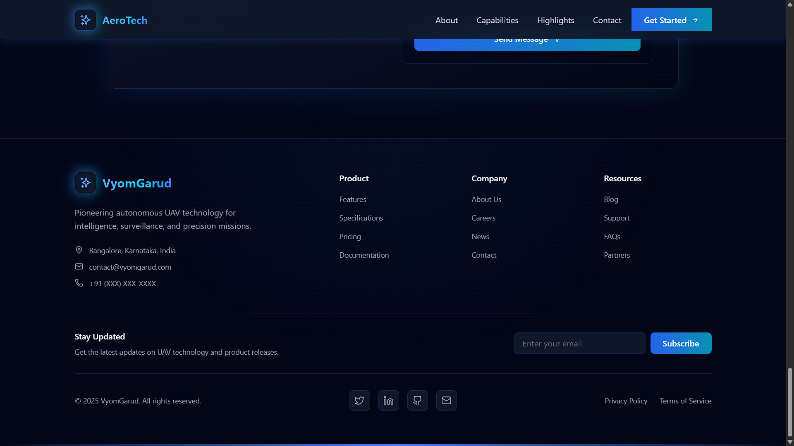
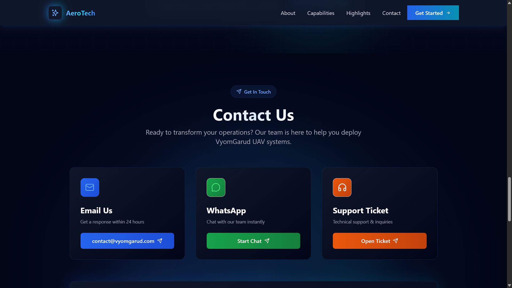
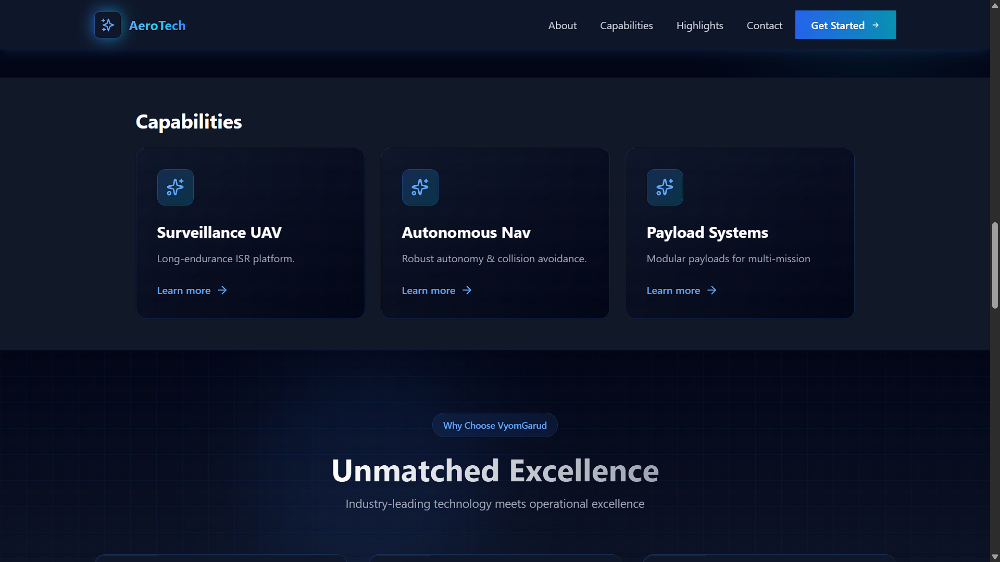
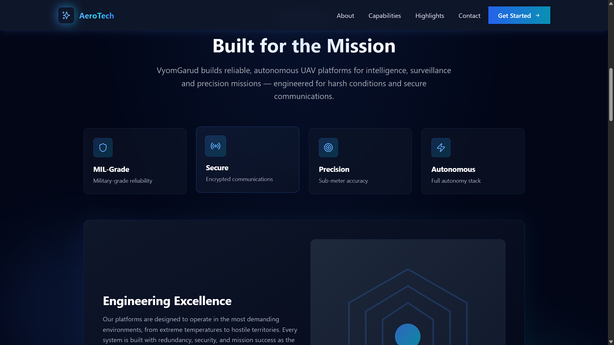
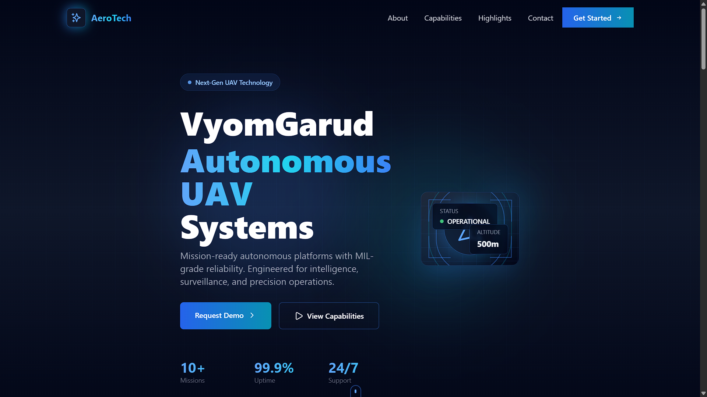

# 🚀 VyomGarud – Landing Page (React + Vite)

Modern, responsive landing page for **VyomGarud**, a UAV / drone systems company with a military-grade, futuristic identity.  
Built with **React + Vite + Tailwind CSS**.

---

## 📦 Tech Stack

- **React 18** (SPA)
- **Vite** (bundler & dev server)
- **Tailwind CSS** for styling
- **Lucide React** for icons
- **Axios** (reserved for future API integrations)

---

## 📁 Project Structure

```bash
/client
├─ node_modules/
├─ src/
│  ├─ components/
│  ├─ sections/
│  ├─ assets/
│  └─ main.jsx
├─ index.html
├─ package.json
├─ postcss.config.cjs
├─ tailwind.config.cjs
└─ vite.config.mjs


> All application code lives inside the `client/src` directory.

---

## ⚙️ Setup & Installation

```bash
# 1. Clone the repo
git clone https://github.com/your-username/vyomgarud-client.git
cd vyomgarud-client/client

# 2. Install dependencies
npm install

# 3. Start development server
npm run dev


## Screenshots






